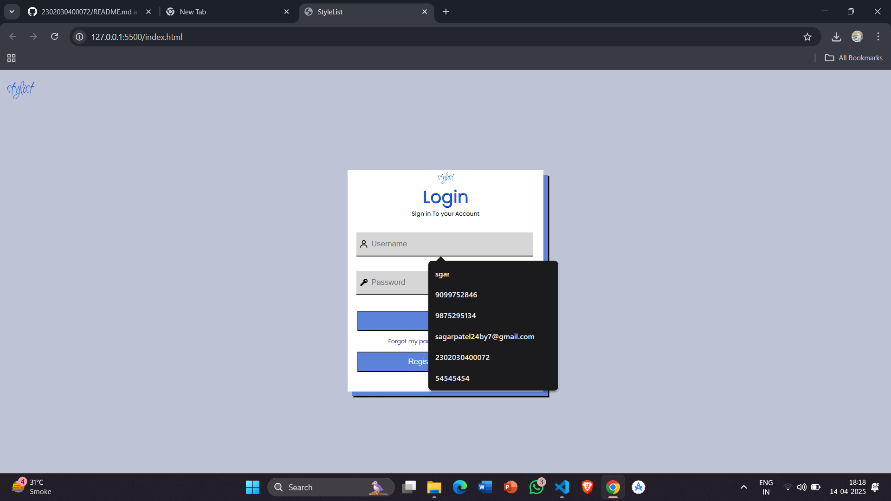
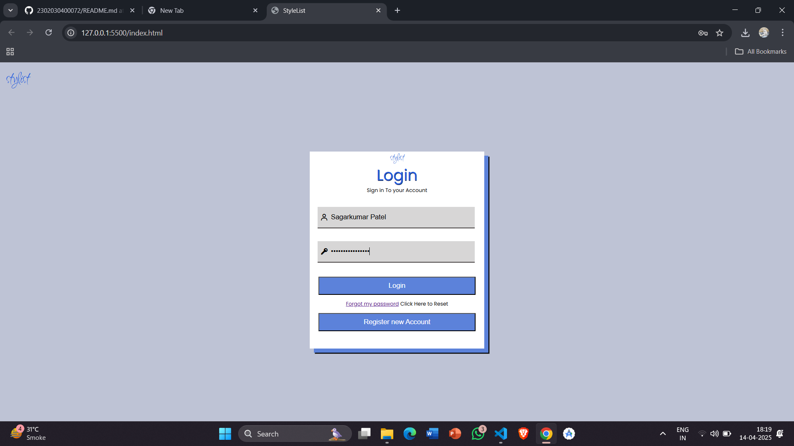
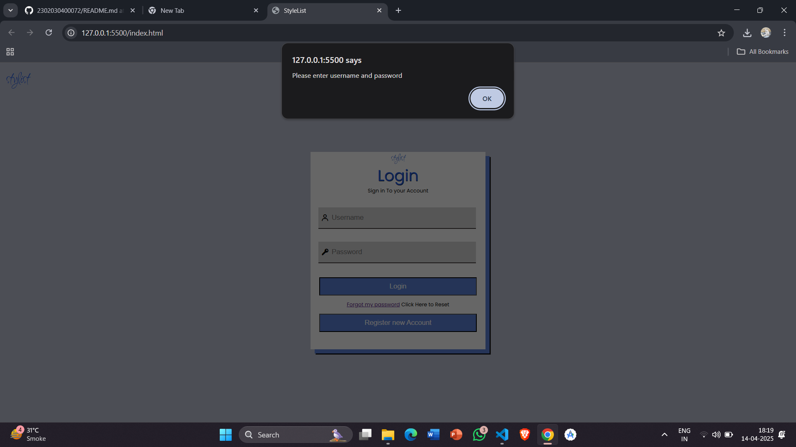
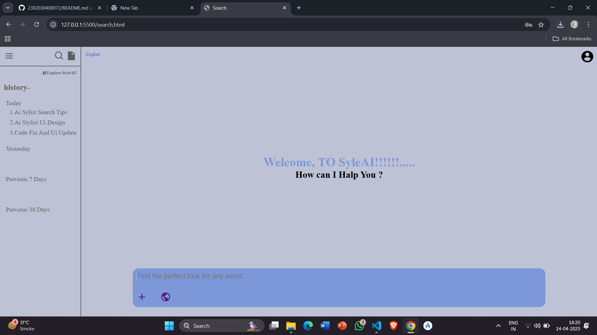
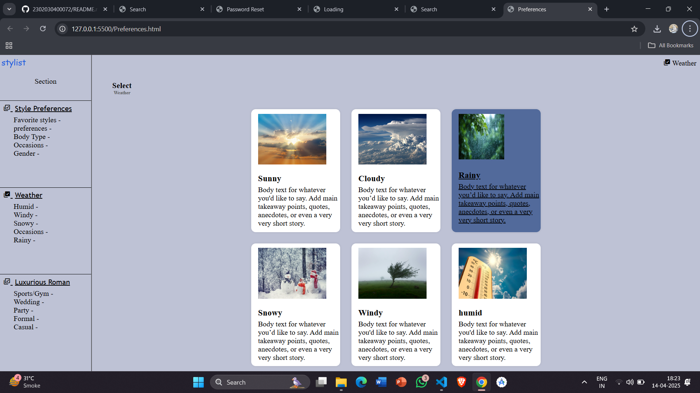
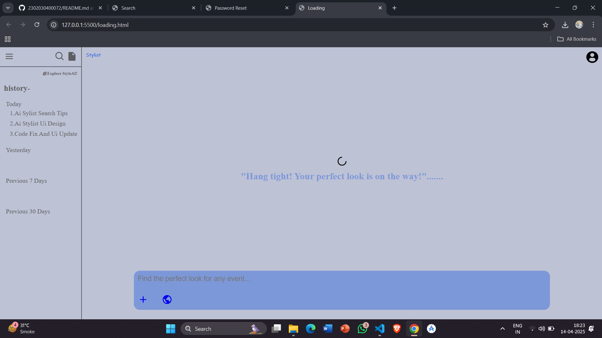
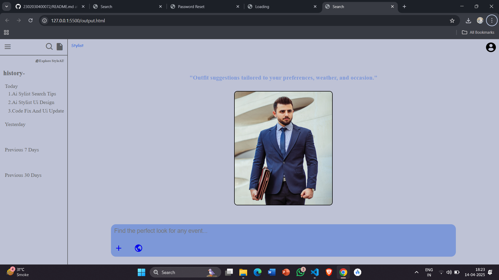
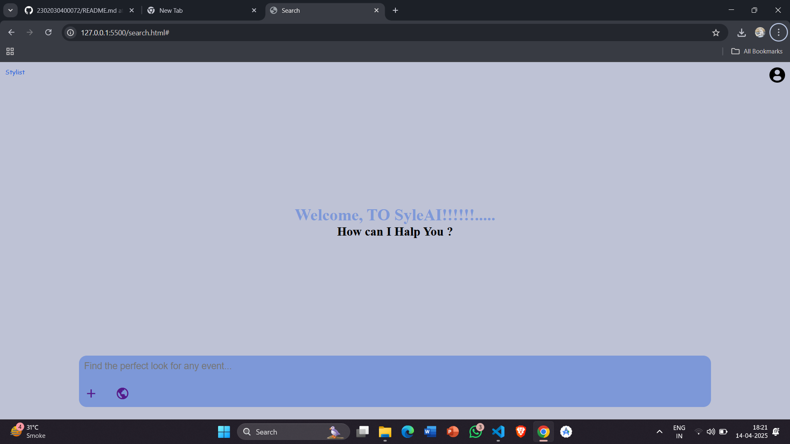
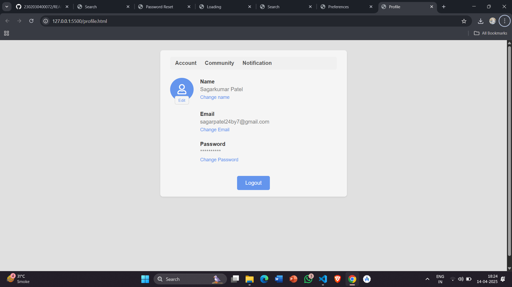

# 2302030400072

## 👗 AI-Based Personal Stylist
A smart fashion assistant that recommends outfits tailored to user preferences, weather conditions, and occasions. Designed with an elegant and user-friendly UI, this app simplifies everyday outfit decisions using AI-driven logic.
## ✨ Features
- 📋 User Profile for preferences and style setup
- 🌤 Weather-based suggestions for practical outfits
- 🎉 Occasion selector (casual, party, meeting, etc.)
- 👚 Outfit preview with suggested combinations
- 🔄 Option to refresh and get new suggestions
## 🖼 UI Screenshots

## 🛠 Tech Stack
- UI Design: Figma (designed and prototyped)

- Proposed Technologies for Development (future scope):

   - Frontend: HTML5, CSS, JS, React

   - Backend: Firebase or Node.js (for user data and preferences)

   - APIs: Weather API & ML Model (for personalized recommendations)
 ## 📌 Objective
To create an AI-powered stylist app that simplifies fashion decisions by analyzing environmental and personal factors, delivering relevant and stylish suggestions.
## 📦 Future Scope
- Integration with e-commerce platforms

- AI-based learning from user feedback

- Personalized daily outfit notifications

- Camera-based virtual try-on

